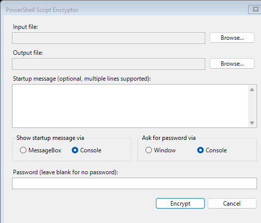

# PowerShell Script Encryptor

A desktop tool that encrypts PowerShell (`.ps1`) scripts into self-contained `.enc.ps1` files. The encrypted output decrypts and runs in memory at launch—no plaintext script is written to disk.

Two implementations are included:

| File | UI | Runtime |
|------|-----|---------|
| `main.ps1` | Windows Forms | PowerShell 5.1+ |
| `main.py` | Tkinter | Python 3.10+ |

## Features

- **AES-256-CBC** encryption with **PBKDF2** key derivation (100,000 iterations)
- **GZip** compression before encryption
- **Chunk scattering** — ciphertext and wrapped key material are split into random-sized pieces and mixed with decoy bytes to obscure structure
- **Optional password** — leave blank for no password, or protect with a user-supplied secret
- **Startup message** — optional multi-line text shown before the script runs (console or MessageBox)
- **Password prompt** — ask for the password via console or a small GUI window at runtime
- **Path preservation** — decrypted scripts receive `$PSScriptRoot` and `$PSCommandPath` so relative paths keep working

## Requirements

### PowerShell (`main.ps1`)

- Windows with **PowerShell 5.1** or later
- .NET assemblies used at runtime: `System.Security`, `System.IO.Compression`, `System.Windows.Forms`

### Python (`main.py`)

- **Python 3.10+**
- [cryptography](https://pypi.org/project/cryptography/) 49.0.0

```powershell
python -m venv .venv
.venv\Scripts\activate
pip install -r requirements.txt
```

## Screenshot



## Usage

### Encrypt a script

**PowerShell:**

```powershell
powershell -ExecutionPolicy Bypass -File .\main.ps1
```

**Python:**

```powershell
python main.py
```

1. Choose the input `.ps1` file.
2. Choose where to save the output (default extension `.enc.ps1`).
3. Optionally set a startup message, display mode, password prompt style, and password.
4. Click **Encrypt**.

### Run an encrypted script

```powershell
powershell -ExecutionPolicy Bypass -File .\script.enc.ps1
```

Pass the password on the command line when needed:

```powershell
powershell -ExecutionPolicy Bypass -File .\script.enc.ps1 -Password "your-password"
```

If no password was set during encryption, the script runs without prompting.

## How it works

```
┌─────────────┐     GZip      ┌──────────────┐     AES-256-CBC     ┌─────────────────┐
│  .ps1 file  │ ────────────► │  compressed  │ ─────────────────► │   ciphertext    │
└─────────────┘               └──────────────┘                    └────────┬────────┘
                                                                           │
                    ┌──────────────────────────────────────────────────────┘
                    │  split into random chunks + decoy bytes
                    ▼
┌──────────────────────────────────────────────────────────────────────────────┐
│  .enc.ps1 wrapper: scattered byte arrays, salt, IV, metadata, decrypt stub   │
└──────────────────────────────────────────────────────────────────────────────┘
                    │
                    │  at runtime: reassemble → unwrap key (PBKDF2) → decrypt
                    │              → decompress → invoke ScriptBlock in memory
                    ▼
              original script runs
```

1. The plaintext script is read as raw bytes, compressed, then encrypted with a random AES key and IV.
2. Key material (32-byte key + 16-byte IV) is wrapped with a password-derived key (or a placeholder when no password is used).
3. Ciphertext and wrapped key are split into variable-length chunks and interleaved with random decoy chunks; order arrays record how to reassemble them.
4. A minimal PowerShell wrapper embeds the chunks and decrypts at runtime, then executes the result via `[ScriptBlock]::Create`.

## Project files

| File | Description |
|------|-------------|
| `main.ps1` | Encryptor GUI and crypto logic (PowerShell) |
| `main.py` | Encryptor GUI and crypto logic (Python) |
| `main.enc.ps1` | Example encrypted output |
| `assets/ui-screenshot.png` | GUI screenshot for documentation |
| `requirements.txt` | Python dependencies |

## Security notes

This tool **obfuscates** scripts and adds a password gate. It is **not** a substitute for proper code signing, access control, or secrets management.

- Anyone with the password (or an unprotected `.enc.ps1`) can recover the original script.
- Determined reverse engineering of the wrapper and embedded byte arrays is possible.
- Use only for legitimate purposes (protecting proprietary automation, reducing casual inspection, etc.).
- Do not rely on this to hide credentials—use secure vaults and environment-specific secret injection instead.

## License

MIT License. See [LICENSE](LICENSE).
